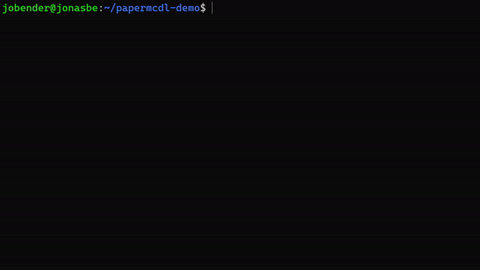

# Papermcdl

Download all PaperMC projects with ease using _papermcdl_.
Choose between a user-friendly [GUI](#gui) or [command-line flags](#cli-with-flags) to streamline the process.
Perfect for developers and Minecraft server admins.

## Installation

You only need to download the binary for your OS, from the latest release.
After extracting the ``zip`` or ``tar`` archive, you can use the binary.

## GUI

The GUI is a user-friendly way to easily download the version of the papermc projects you want.
You can access it using ``papermcdl`` without any flags

## CLI with flags

You can use the downloader without the GUI using flags. 
If a value is not valid, you're getting a list with the valid values.
If all required flags have valid values, the project get downloaded.

| Flag | Required | Default   | Description                                                            |
|------|----------|-----------|------------------------------------------------------------------------|
| -p   | YES      |           | Specify the papermc project                                            |
| -v   | YES      |           | Specify the version of the project or use ``l`` for the latest version |
| -b   | NO       | ``l``     | Specify the build number or use ``l`` for the latest build             |
| -i   | NO       | ``false`` | Add this flag, if you only want infos                                  |
